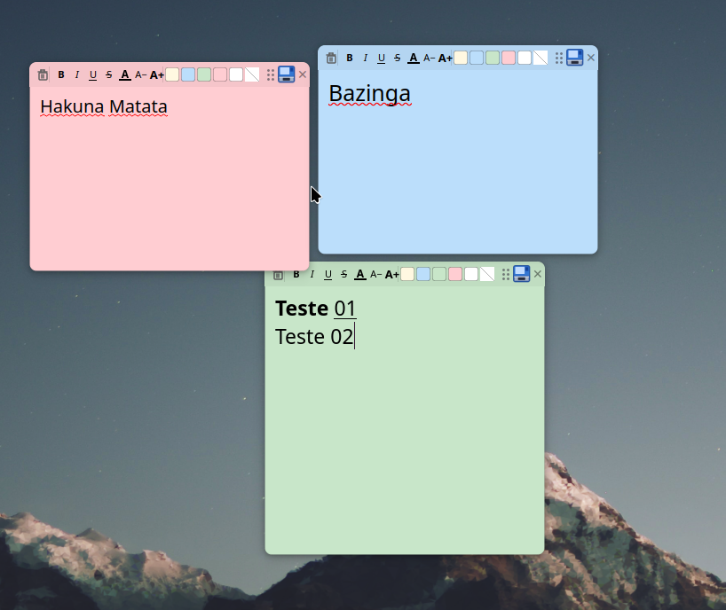

# Stickies

**Português** | [English](README.md)


Notas adesivas flutuantes para Linux, construído com **Qt6/C++** e com suporte nativo a **Wayland**.



## Funcionalidades

- Múltiplas notas simultâneas, sempre visíveis sobre outras janelas
- Formatação de texto: negrito, itálico, sublinhado, tachado, cor e tamanho da fonte
- **Correção ortográfica PT-BR** com sugestões no botão direito — dicionário embutido, sem instalar nada
- Cores personalizáveis por nota (amarelo, azul, verde, vermelho, branco, transparente)
- Arrastar e redimensionar por qualquer borda/canto
- Posição, tamanho e conteúdo salvos e restaurados automaticamente
- **Backup automático**: salva via `.tmp` → `.bak` → `.json`, protegendo contra perda de dados em caso de crash
- Exportar notas para **HTML** ou **Markdown**
- Ícone na bandeja do sistema com menu de ações
- Atalhos: `Ctrl+N` nova nota, `Ctrl+Shift+S` salvar tudo, `Ctrl+Shift+W` esconder tudo

## Download

Baixe o AppImage na página de [Releases](https://github.com/povman/stickies/releases) — não requer instalação.

```bash
chmod +x Stickies-x86_64.AppImage
./Stickies-x86_64.AppImage
```

## Compilar do código fonte

**Dependências:**

```bash
# Arch / Manjaro
sudo pacman -S qt6-base cmake hunspell
```

**Build:**

```bash
git clone https://github.com/povman/stickies.git
cd stickies
cmake -B build -DCMAKE_BUILD_TYPE=Release
cmake --build build -j$(nproc)
./build/stickies
```

**Gerar AppImage:**

```bash
bash build-appimage.sh
```

## Arquivos de dados

As notas são salvas em:

```
~/.config/stickies/notes.json
~/.config/stickies/notes.json.bak  ← backup automático
```

## Licença

MIT © [Fabio Moraes](https://fabiomoraes.sisdigital.com.br)
